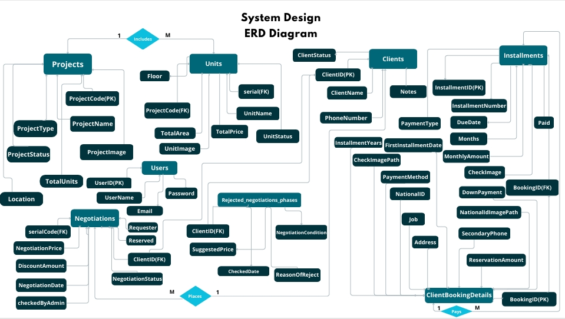
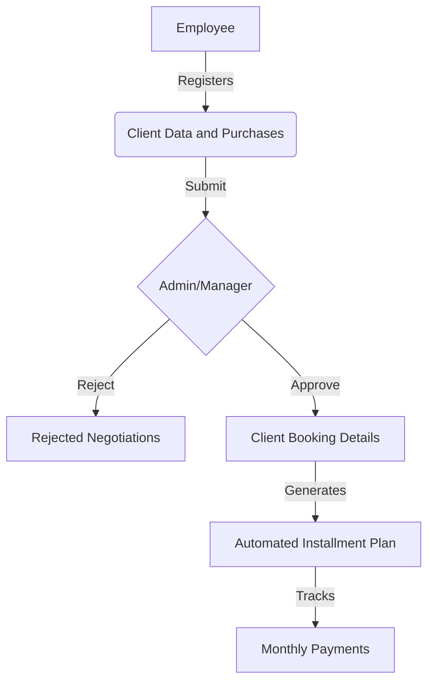

# Real Estate Management System v2 (Clean Architecture & Dapper)

> This is a refactored version of [Real Estate Management System](https://github.com/Toqa-Ashraf8/realestate_management_system), applying Clean Code, Repository Pattern, and Dependency Injection.

##  The Evolution (Refactoring Story)
While the first version focused on core business logic, this version (v2) was developed to solve architectural challenges:
* **From Monolithic to Clean Architecture:** Separated the project into layers (API, Core, Service, Repository) to achieve **Decoupling**.
* **From EF/ADO to Dapper:** Replaced standard data access with **Dapper ORM** for 10x faster query execution and full control over SQL.
* **Infrastructure Upgrades:** Implemented **Generic Repository Pattern** and **SQL Transactions** to ensure data consistency.

## Architectural Overview
This version follows **Clean Architecture** to ensure a clear **Separation of Concerns**:
* **API Layer:** RESTful endpoints with **Thin Controllers** and **DTOs**.
* **Repository Layer:** High-performance data access using **Dapper**.
* **Core Layer:** Centralizes Domain Models and Repository Interfaces.

##  Technical Highlights
* **Optimized Performance:** Used **Dapper's QueryMultiple** and **Async/Await** to minimize database round-trips.
* **Robust Transactions:** Managed complex "Unit Booking" workflows using **SQL Transactions** (Commit/Rollback) to guarantee data integrity.
* **Cleaner Logic:** Solved previous "Future Roadmap" challenges by centralizing business rules in the Service layer.

##  Tech Stack
* **Frontend:** React.js, Redux Toolkit, Bootstrap.
* **Backend:** .NET 8 Web API, **Dapper**, SQL Server.
* **Database:** MS SQL Server (Complex Joins, Views).

##  Core Features (Legacy & New)
* **Secure RBAC:** Custom dashboards for Admins and Employees.
* **Master-Detail Inventory:** Dynamic management of Projects and Units.
* **Automated Installment Engine:** Real-time generation and tracking of payment schedules.
* **Advanced Negotiation Workflow:** Integrated "Managerial Decision Engine" for price approvals.

##  Database Architecture & Logic
The system relies on a robust relational schema:
* **One-to-Many:** Projects ➡️ Units.
* **Many-to-One:** Negotiations ➡️ Clients & Units.
* **Automation:** The system pulls validated client data into the booking phase automatically to ensure data integrity and zero manual entry errors. 

###  Database Schema (ERD)
The system relies on a highly normalized relational schema to ensure data integrity.

##  System Workflow (Business Logic)

## 🔧 Installation & Setup
1. Clone the repo: `git clone https://github.com/Toqa-Ashraf8/realestate-management-refactored.git`
2. **Backend:** - Update `appsettings.json` with your SQL connection string.
   - Run `dotnet run`.
3. **Frontend:** - Run `npm install` then `npm start`.
